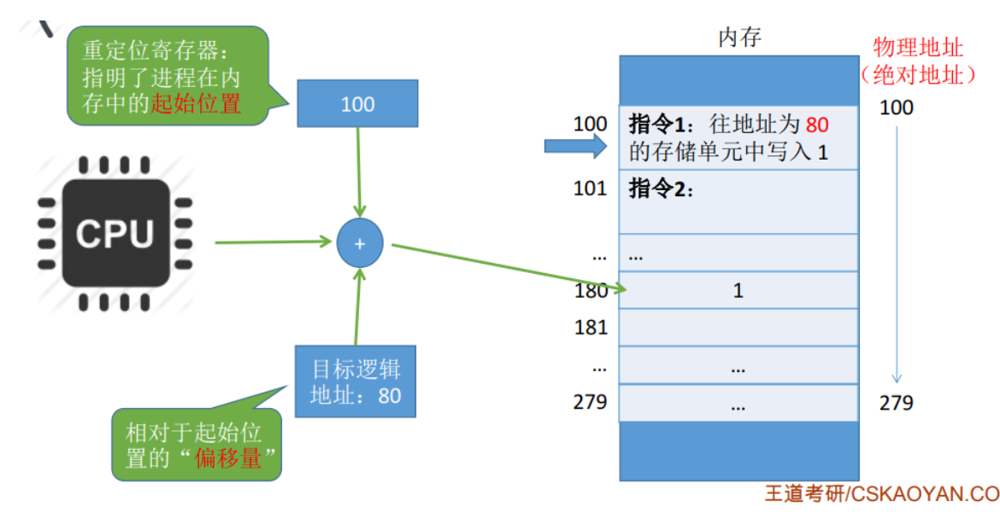

# 操作系统速成

# 第一章 绪论

## 2.1 OS作用、定义、地位

- 作用：CPU管理、存储器管理、 设备管理、 文件管理、 操作系统接口
- 定义：控制和管理计算机硬件、软件资源，合理对各类作业进行调度，以方 便用户使用的程序集合

## 2.2 多道程序设计

内存中同时驻留多个程序，使它们共享系统资源，并发运行

多道程序设计硬件支持：中断、通道

## 2.3 主要操作系统类型和各自特点

## 2.4 OS特征

并发、共享、虚拟、异步

## 2.5 CPU工作态（系统态和用户态）及其转换

用户态->内核态：采用中断（硬件自动中断）

内核态->用户态：执行特权指令，并修改状态寄存器

内中断：CPU内部的，比如异常等

外中断：CPU外部的，比如I/O中断，时钟中断

系统调用：命令接口+程序接口

操作系统作为用户和计算机硬件之间的接口，需要向上提供一些简单易用的服务，主要包括**命令接口**和**程序接口**，其中程序接口由一组**系统调用**组成

# 第二章 进程管理

## 2.1 进程定义、引入原因、特征、分类

定义：程序关于某个数据集合的一次执行过程，是 系统进行资源分配和调度的一个独立单位

特征：并发，动态，异步，独立，结构（进程由程序+数据+PCB共同构成）

分类：

引入原因：引入多道程序设计概念后，由于并发执行的不确定性等因 素，需要引入进程来描述程序执行过程

## 2.2 PCB

包括：进程描述信息（PID和UID），处理机信息（处理机的寄存器），进程调度信息，进程控制信息

组织方式：1.线性方式 2.链式方式 3.索引方式

作用：PCB是进程的重要组成部分、 PCB是操作系统中最重要的记录型数据结构 、PCB是进程存在的唯一标志 、PCB常驻内存

## 2.3 进程基本状态

就绪状态、执行状态、阻塞状态

## 2.4 进程控制、原语、进程创建、进程阻塞、进程唤醒

定义：一般地，把系统状态下执行的某些具有特定功能的程序段称为原语

原语特点：原语由若干条指令组成。 在执行过程中不允许被中断，原语在管态下执行，常驻内存。

### 进程相关的原语

##### 1. 创建原语

> 操作系统创建一个进程时使用的原语，使得程序由创建态转为就绪态

- 申请空白PCB
- 为新进程分配所需资源
- 初始化PCB
- 将PCB插入就绪队列

##### 2. 引起进程创建的事件

- 用户登录 分时系统中，用户登录成功，系统会建立为其建立一个新的进程
- 作业调度 多道批处理系统中，有新的作业放入内存时，会为其建立一个新的进程
- 提供服务 用户向操作系统提出某些请求时，会新建一个进程处理该请求
- 应用请求 由用户进程主动请求创建一个子进程

##### 3. 进程的终止

##### 4. 进程的阻塞和唤醒

## 2.5 进程同步

原则：空闲让进、忙则等待、等待有限、让权等待

> 信号量：

整型信号量：会忙等

记录型信号量（题目中一般默认是这个），会不断检测信号量的数值

> PV操作

mutex：互斥信号量

P：申请资源   V：释放资源

## 2.6 同步实现算法

。。

## 2.7 进程通信

共享存储区：有：基于存储区的共享（非操作系统管理），基于数据结构的共享存储区

信箱：属于间接通信方式

管道：其实是一个队列的形式，前面的数据不读的话，就不能读后面的数据，管道只要没空就可以一直读，并且按照考研真题来讲，一个管道是允许多个写进程，一个读进程

## 2.8 线程定义、引入原因

# 第三章——处理机调度

## 3.1 调度层次

挂起队列位于外存，就绪队列位于内存

挂起态：暂时调到外存等待的队列

阻塞态：仍然位于内存中

调度器：是一个内核程序，发生调度时会执行该程序

时钟中断：检查新旧程序的优先级，通过时钟中断来触发

## 3.2 调度算法

### 3.2.1 评价指标

## 3.2 作业调度和进程调度算法

### 3.2.1 作业调度

- 高级调度，又称作业调度

> 主要任务是按一定的原则对外存上处于后备状态的 作业进行选择，给选中的作业分配内存、输入/输出 设备等必要的资源，并建立相应的进程，插入就绪 队列，以使该作业的进程获得竞争处理机的权利

- 低级调度，也称进程调度

主要任务是按照某种策略和方法选取一个处于就绪 状态的进程，将处理机分配给它

### 3.2.2 调度算法

先来先服务算法、短作业优先算法，高响应比优先算法，时间片轮转算法，优先级调度算法，多级反馈队列算法

## 3.3 死锁

### 3.3.1 概念

- 在并发环境下，各进程因竞争资源而造成的一种**互相等待对方手里的资源，导致各进程都阻塞，都无法向前推进的现象**，就是“死锁”发生死锁后若无外力干涉，这些进程都将无法向前推进

### 3.3.2 产生死锁的必要条件

- **互斥条件**:只有对必须互斥使用的资源的争抢才会导致死锁(如哲学家的筷子、打印机设备）。像内存、扬声器这样可以同时让多个进程使用的资源是不会导致死锁的(因为进程不用阻塞等待这种资源）。
- **不剥夺条件**:进程所获得的资源在未使用完之前，不能由其他进程强行夺走，只能主动释放。
- **请求 和 保持条件**:进程已经保持了至少一个资源，但又提出了新的资源请求，而该资源又被其他进程占有，此时请求进程被阻塞，但又对自己已有的资源保持不放。
- **循环等待条件**:存在一种进程资源的循环等待链，链中的每一个进程已获得的资源同时被下一个进程所请求

这四个必要条件中只要有一个条件不满足，**都不会形成“死锁”**

### 3.3.3 死锁预防

打破上述四个条件任意之一即可

### 3.3.4 避免死锁

使系统不进入不安全状态

# 第四章——存储器管理

## 4.1 程序装入与链接

装入：绝对装入方式、静态重定位方式、动态重定位方式

链接：静态链接方式、装入时动态链接、运行时动态链接

## 4.2 覆盖与对换

内部碎片与外部碎片

- 覆盖技术：需要时才调入内存，解决内存大小超过物理内存总和的问题（常用的段常驻内存，放在固定区，不常用的段需要时才调入内存，放入覆盖区）

- 交换技术：当内存空间紧张时，系统讲内存中某些进程暂时换出外存，把外存中某些已具备运行条件的进程换入内存
- 对换功能的操作系统中，磁盘分文件区和对换区，对换区一般连续分配内存，文件区一般离散分配，故对换区i/o速度比文件区更快

## 4.2 固定分区

概念：将用户空间划分为若干个固定大小的分区，分区大小不一定相等（所以有两种固定分区的方式）。（内存通常分为系统区和用户区），没有外部碎片，但会产生内部碎片，内存利用率低

## 4.3 动态分区分配

- 不会预先划分内存分区，在进程装入内存时根据进程的大小动态地建立分区，并使分区的大小正好适合进程的需要

内存使用情况的记录：空闲分区表、空闲分区链

## 4.4 动态分配算法

> 以下都是动态分配的算法，并不是固定分区的方式，这里的空闲分区是空闲分区表中的。

- 首次适应算法：空闲分区**以地址递增的次序排列**。**每次分配内存时顺序查找空闲分区链 (或空闲分区表)，找到大小能满足要求的第一个空闲分区**
- 最佳适应算法：空闲分区按容量递增次序链接。每次分配内存时顺序查找空闲分区链(或空闲分区表)，找到大小能满足要求的第一个空闲分区。（会产生很多的外部碎片。）
- 最坏适应算法：空闲分区按容量递减次序链接。每次分配内存时顺序查找空闲分区链(或空闲分区表)，找到大小能满足要求的第一个空闲分区
- 临近适应算法：空闲分区**以地址递增的次序排列**，每次分配内存时从上次查找结束的位置开始查找空闲分区链 (或空闲分区表)，找到大小能满足要求的第一个空闲分区。

## 4.5 页式管理存储方案

### 4.5.1 基本概念

- 页框：内存空间分为一个个大小相等的分区，每个分区就是一个页框
- 页面：进程的逻辑地址空间分为与页框大小相等的一个个部分
- 页框=内存块=物理块=物理页=页帧
- 页框号从0开始
- 进程的每个页面分别放入一个页框中
- 各个页面可以放到不相邻 的每个页框中
- 进程的各个页面是离散存放的，但是页面内部是连续存放的

### 4.5.2 页表

- 页表记录进程的每个页面在内存中存放位置
- 进程的每个页面对应一个页表项
- 每个页表项由“页号”和“块号”组成
- 页表记录进程页面和实际存放的内存块之间的映射关系
- 页表寄存器中存放页表在内存中的起始地址和页表长度
- 页表长度指的是这个页表中总共有几个页表项，即总共有几个页
- 页表被保存到主存中

### 4.5.3 逻辑地址结构

由页号和页内偏移量组成

逻辑地址如何转变为物理地址：

根据逻辑地址结构确定页号和页内偏移量，然后判断是否越界，如果正常则确定页面对应的页表项，根据页表项确定对应的物理块号，然后物理块号+页内偏移量=实际物理地址

- 在这个机制中，每 一次的数据/指令存 取需要**两次内存访 问**，一次是访问页 表，一次是访问数 据/指令

### 4.5.4 快表

- 存放最近访问的页表项的副本，集成在CPU中，没有在内存中存放

如果快表命中则只需要进行一次访存即可。

> 根据程序执行局部性的特点，在一段时间总是经常访问某些 页，若把这些页登记在快表中，则可快速查找并提高地址变 换速度

### 4.5.5 计算题

- 计算页表项的大小

- 地址转换

重定位寄存器会告诉我们起始位置，而逻辑地址就相当于一个偏移量，所以我们将二者相加即可得到一个真实的物理地址。即：物理地址=逻辑地址+起始地址

- 计算页号和页内偏移量

- 快表命中率应用

## 4.6 段式存储

> 某老师PPT并未提此部分，我觉得此部分极大概率不考，但是，我还是简单看一下吧

- 按照程序**自身的逻辑**关系**划分为若干个段**，每个段都有一个段名（在低级语言 中，程序员使用段名来编程），**每段从0开始编址**，每个段有自己的段名，而编译程序会将各个段名划分为段号

# 第五章——虚拟存储器

## 5.1 引入、定义、大小、特征、理论依据

- 定义：具有**请求调入功能**和**置换功能**，能从逻辑 上对**内存容量**加以扩充的一种存储器系统
- 大小：其逻辑容量由内存容量和外存容量之和所决定，其运行 速度接近于内存速度，而成本接近于外存

- 特征：多次性、对换性、虚拟性
  - 多次性：无需在作业运行时一次性全部装入内存，而是允许被分成多次调入内存
  - 对换性：在作业运行时无需一直常驻内存，而是允许在作业运行过程中，将作业换 入、换出
  - 虚拟性：从逻辑上扩充了内存的容量，使用户看到的内存容量，远大于实际的容量
- 引入：常规方式下“一次性”和“驻留性”
- 理论依据：局部性原理

## 5.2 请求分页

### 5.2.1 基础概念

- 缺页中断是内中断

### 5.2.2 缺页中断处理过程

在请求分页系统中，每当要访问的页面不在内存时，便产生一个缺页中断，然后由操作系统的缺页中断处理程序处理中断。此时缺页的进程阻塞，放入阻塞队列，调页完成后再将其唤醒，放回就绪队列

如果内存中有空闲块，则为进程分配一个空闲块，将所缺页面装入该块，并修改页表中相应的页表项。
如果内存中没有空闲块，则由页面置换算法选择一个页面淘汰，若该页面在内存期间被修改过，则要将其写回外存。未修改过的页面不用写回外存。

## 5.3 何时调入页面

- 预调入策略（一次调入若干个相邻的页面可能比一次调入一个页面更高效）
- 请求调入（在运行期间发现缺页时才将所缺页面调入内存，每次只调入一页）

## 5.4 从何处调入页面

**对换区。**

运行之前，与程序相关的数据都是存放在文件区的。如果对换区够大，会将进程相关数据在运行之前复制到对换区，然后进行内存与对换区的交换，如果不够大，会将页面从内存中调出到对换区，然后内存和对换区二者实现互相交换以及调入与调出

## 5.5 页面置换算法（淘汰算法）

# 第六章——输入输出系统

- 通道：使一些原来由CPU处理的I/O任务转由通道来承担，从而把CPU从 繁杂的I/O任务中解脱出来
- 设备无关性：为了提高OS的可适应性和可扩展性，在现代OS 中都无一例外地增加了与设备无关的I/O软件， 以实现了设备独立性，也称设备无关性。
- spooling技术

# 第七章——文件管理

文件和文件系统

# 第八章——磁盘存储器管理

不同的外存组织方式，将形成不同的文件物理结构。 

- 连续组织方式：形成的文件物理结构是顺序文件。 
- 链接组织方式：形成的文件物理结构是链接文件。 
- 索引组织方式：形成的文件物理结构是索引文件

# 第九章

系统调用：是OS提供给编程人员的唯一接口（程序接口）

系统调用是由操作系统中的一段程序来完成特定功能的（如 打印、读写盘等），属于一种特殊的过程调用

调用的方式：采用访管方式来实现。通过产生一个访管中断， 使处理机由目态（用户态）转为管态（系统态）

系统调用特点：

1、每个系统调用对应一个系统调用号； 

2、每个系统调用有一个对应的执行程序段； 

3、每个系统调用要求一定数量的输入参数和返回值； 

4、整个系统有一个系统调用执行程序入口地址表；

系统调用与过程调用的区别：

- 执行状态不同 
- 进入方式不同