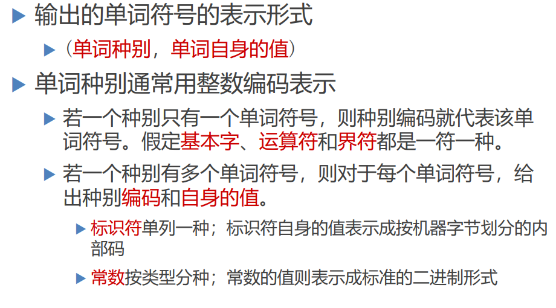

# 编译原理

# 第三章——词法分析

## 3.1词法分析器的要求

> 词法分析器的任务

从左至右逐个字符地对源程序进行扫描，产生一个 个单词符号

> 词法分析器的功能

其实就是一个扫描器，执行词法分析的程序

### 3.1.1 词法分析器的输入与输出

> 输入

> 输出

### 3.1.2 词法分析器作为一个独立的子程序

- 词法分析作为一个独立的阶段，相当于一个整体的一个结构
- 但不一定不作为单独的一 遍，也就是相当于一个函数，每当需要的时候可以进行反复调用

## 3.2 词法分析器的设计

### 3.2.1 词法分析器的输入与预处理

> 预处理子程序在扫描器的调用下，将源程序输入到输入缓冲区中，子程序读取输入缓冲区中的字符，进行处理，经过预处理子程序后，比较规范的文字被送入扫描缓冲区中，然后扫描器再读取扫描缓冲区中的字符串，根据词法规则识别出单词符号

### 3.2.2 扫描缓冲区一分为二

> 问题：我们一般把要扫描的单词或句子放入扫描缓冲区中，但有时候一个单词可能过长，导致只有一部分单词在缓冲区中。当搜索指示器到结尾依然没有找到单词结尾时，就会触发预处理子程序，预处理子程序会从文件和输入缓冲区中处理一批字符，送到扫描缓冲区中，但此时新送的一批字符会将上一次的字符覆盖掉，则那个不完整的单词仍然无法被识别。34

> 所以为了解决这个问题，我们引入扫描缓冲区一分为二的概念。扫描器通过两个指针来实现

- 起点指示器指向马上要开始开始识别的单词位置
- 搜索指示器从开始位置前进寻找单词的结尾

- 一分为二，将扫描缓冲器一分为二，一开始只扫描一半的区域，然后一半扫描完了，再调用预处理子程序，然后引入下一般，这样就能识别到单词的结尾了。

所以**半区长度就是程序语言允许的单词的最大长度**，比如某语言的标识符最大长度是128，那么就可以推断出它的扫描区缓冲区总长度为256.

### 3.2.3 单词符号的识别：超前搜索

> 就是从左往右扫描的过程中，有时候往往需要多往 右边扫描一点，然后触发到某个符号才想起来之前已经扫描到了那个基本字，然后进行回溯即可。

> 目前语言增加了一些限制，使得可以不必使用超前搜索

### 3.2.4 状态转换图

- 状态转换图是一张有限方向图
  - 结点代表状态，用圆圈表示
  - 状态之间用箭弧连结，箭弧上的标记(字符)代表射出 结状态下可能出现的输入字符或字符类(比如结点1读入字符a进入状态2；比如结点1识别了数字类的东西然后进入了状态3)
  - 一张转换图只包含有限个状态，其中有一个为初态， 至少要有一个终态

- 状态转换图可用于识别(或接受)一定的字符串
  - 若存在一条从初态到某一终态的道路，且这条路上所有弧上的标记符连接成的字等于α，则称α被该状态转换图所识别

> 如图：1状态识别数字进入2状态，如果2状态继续识别数字那么就依旧停留在2状态，识别其它的则进入3状态。该图用来识别整常数。

> 识别标识符如下：

### 3.2.5 词法分析器的设计示例

> 只需在状态2上做一些附加的判断即可判断出是否是关键字

### 3.2.6 状态转换图的编程实现

- 每个状态结点对应 一小段程序

> 不含回路的分叉结点

> 含回路的状态结点

> 终态结点
>
> 注：双圆圈代表终态

## 3.3 正规表达式与有限自动机

### 3.3.1 正规集和正规式

- 正规集是一类字的集合，程序语言定义的合法单词的集合就是正规集，为了更好地表示正规集，我们用正规式作为正规集的代表和命名

#### 3.3.1.1 正规集和正规式之间的关系

#### 3.3.1.2 正规式和正规集的递归定义

> 注： 字就是字符串，字母表中的东西是字符，也是正规式

对给定的字母表 Σ

1) ε 和 ∅都是 Σ上的正规式，它们所表示的正规集为 { ε } 和 ∅;（ε是一个不包含任意字符的，长度为0的字，它不是字符，同时它也是一个正规式；∅是一个集合，也是一个正规式）
2) 任何 a∈Σ ，a 是 Σ上的正规式，它所表示的正规集为 {a} ;
3) 假定 e 1 和 e 2都是 Σ上的正规式，它们所表示 的正规集为L(e 1 ) 和L(e 2 )，则
   - **(e 1|e 2 )**为正规式，它所表示的正规集为 L(e 1 ) ∪L(e 2 )
   - **(e 1.e 2 )**为正规式，它所表示的正规集为 L(e 1)L(e 2 )
   - **(e 1 )`*`** 为正规式，它所表示的正规集为 (L(e 1))`*`(`*`表示的是一个闭包运算，一个字集的闭包还是正规集)

> 仅由**有限次**使用上述三步骤而定义的表达式才 是 Σ上的正规式，仅由这些正规式表示的字 集才是 Σ上的正规集。

#### 3.3.1.2 正规式的等价性

- 若两个正规式所表示的正规集相同，则称这两 个正规式**等价**。如`b(ab)*=(ba)*b`

> 证明如下：

#### 3.3.1.3 正规式的性质

> e1e2≠e2e1，连接运算没有交换律

### 3.3.2 确定有限自动机

#### 3.3.2.1 状态图进行形式化定义

- 对状态图进行形式化定义

- 举例说明含义

> 如下图，f(0,a)=1，代表0状态识别a之后到了状态1

#### 3.3.2.2 DFA表示为状态转换图

#### 3.3.2.3 DFA识别类型判断 

> 判断类型一定要是找到一条能确定的规则。多写几条路得到的字符串，然后找他们的共同特点
>
> 注：双圆圈代表终态

#### 3.3.2.4 习题

> 如下选A

### 3.3.3 非确定有限自动机

#### 3.3.3.1 定义

> 非确定性体现在，首先初始状态不唯一，其次状态转换函数结果可能有多个

#### 3.3.3.2 状态图看NFA与DFA的区别

#### 3.3.3.3 NFA识别状态判断

> 对于NFA来说，有多个初始态的，只要找到一条从初始态到终态的通路即可

