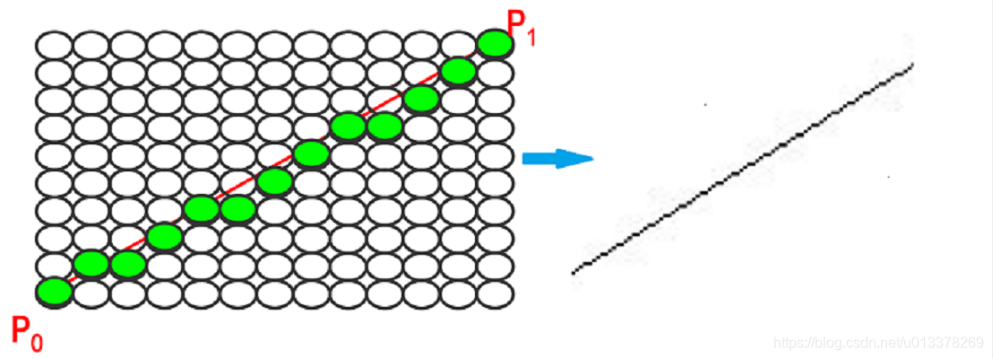
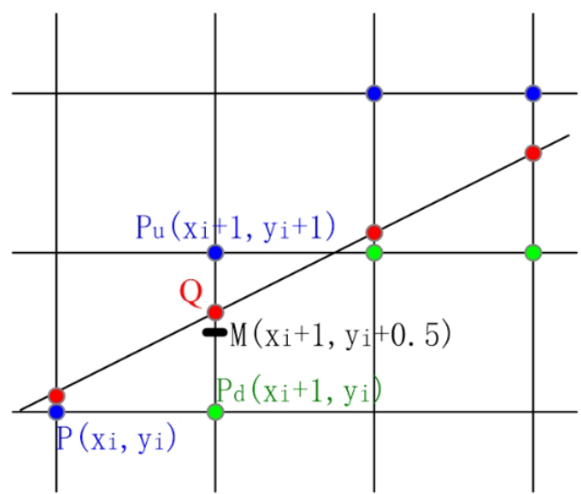

# 计算机图形学

### 第三章——二维基本图形光栅化

## 3.1 直线光栅化DDA

- 直线光栅化DDA画线算法

> 在数学上直线是由无数个点组成，在光栅显示器上，用有限个逼近的像素点来表示直线，因此最终显示的屏幕上的也不是光滑的线



```c++
#include "tgaimage.h"
#include<stdio.h>


//用于定义两个TGAColor类型的常量white和red
const TGAColor white = TGAColor(255, 255, 255, 255);//这个代表白色
const TGAColor red = TGAColor(255, 0, 0, 255);//这个代表红色

//color 代表颜色，要一个TGA对象。image是一个TGAImage对象的引用，表示要在其中绘制直线
void line(int x0, int y0, int x1, int y1, TGAImage &image, TGAColor color)
{
    // Please add the code here
    /********** Begin ********/
    
    //计算步长方向
    int dm=0;
    if(int(x1-x0)>int(y1-y0))//斜率小于1
    {
        //dm总循环方向长度
        dm=int(x1-x0);//x为步长方向
    }
    else
    {
        //斜率大于1
        dm=int(y1-y0);
    }
    
    //计算dx和dy每步走多少，谁为步长方向则谁的步长就是整数1
    float dx=(float)(x1-x0)/dm;//若x为步长，dx=1;反之，若不是，则dx就不是整数
    float dy=(float)(y1-y0)/dm;//若y为步长，dy=1;
    float x=x0;
    float y=y0;//从起点开始
    
    //开始循环花点，以逼近的方式去画点
    for(int i=0;i<=dm;i++)
    {
        image.set((int)(x+0.5),(int)(y+0.5),color);
        x+=dx;
        y+=dy;
    }

    /********** End *********/
}

int main(int argc, char** argv)
{
	TGAImage image(640,480, TGAImage::RGB);
	line(13, 20, 180, 140, image, white);
	image.flip_vertically(); // i want to have the origin at the left bottom corner of the image
	image.write_tga_file("../img_step1/test.tga");
	return 0;
}
```

## 3.2 直线光栅化中点线画法

